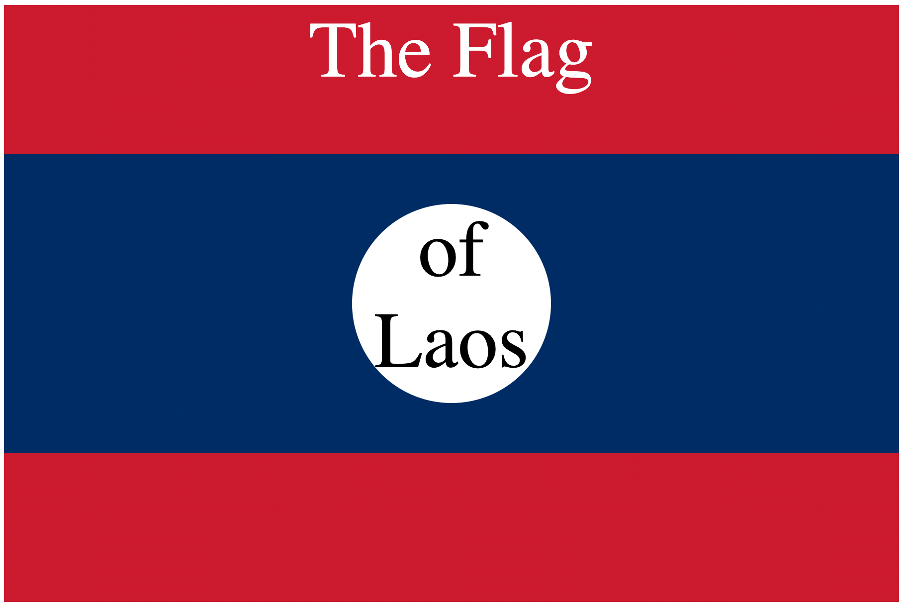

# CSS Flag Project: Flag of Laos

This project showcases the creation of the flag of Laos using only HTML and CSS.

## Overview

This repository contains the code for generating the flag of Laos using HTML and CSS. The flag is created dynamically within the browser using CSS for styling and positioning.

## Preview

## How to Use

To view the flag:

1. Clone this repository to your local machine.
2. Open the `index.html` file in a web browser.

## Credits

This project was created by Claudio Junior.

## Resources

- [Flag of Laos](https://en.wikipedia.org/wiki/Flag_of_Laos)
- [App Brewery Flag of Laos](https://appbrewery.github.io/flag-of-laos/)

